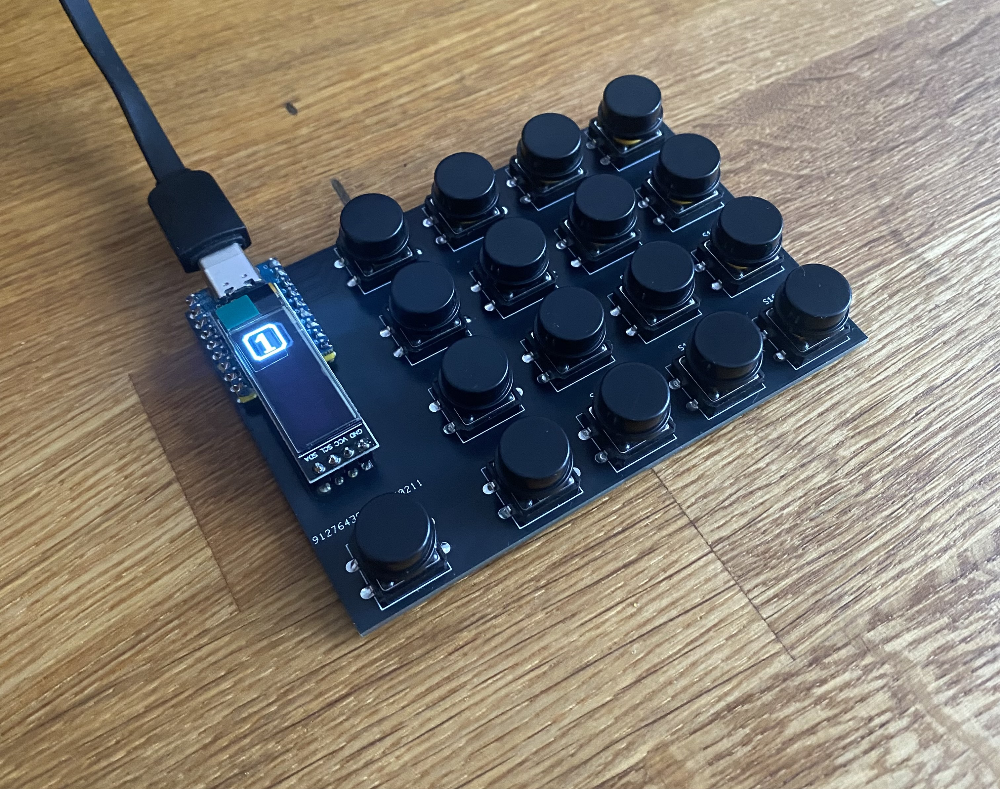
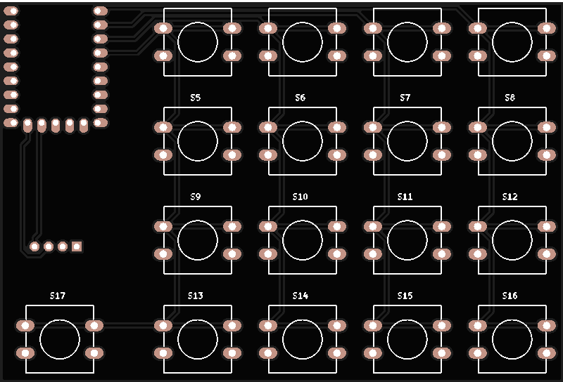
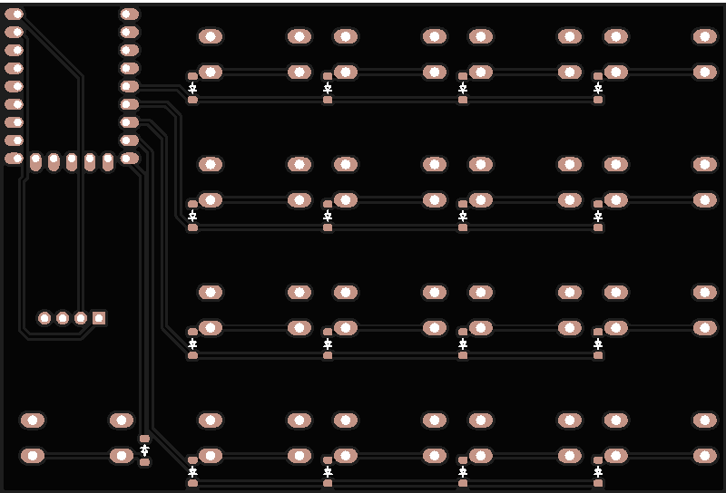

# ⌨️ Cheap Deck – Makro Deck oparty na RP2040-Zero

## 📖Opis
Cheap Deck to kompaktowe urządzenie pozwalające na szybkie przypisywanie i wykonywanie makr bez konieczności programowania. Umożliwia on dynamiczne przypisywanie przycisków do różnych funkcji za pomocą **VIA**, co czyni go idealnym narzędziem do automatyzacji pracy, edycji wideo, gier i wielu innych zastosowań.

## 🔧Specyfikacja
- **Mikrokontroler:** RP2040-Zero
- **Przyciski:** Tact Switch 12x12mm
- **Diody** 1N4148W SOD123
- **Ekran OLED:** oled 0.91 ssd1306

## 📟PCB
Płyta PCB została zaprojektowana z myślą o prostocie montażu. Matryca klawiszy 4x4 podłączona jest do RP2040-Zero poprzez GPIO. Obsługa ekranu OLED odbywa się przez magistralę I2C. Układ jest zasilany przez złącze USB-C, które służy również do programowania mikrokontrolera.

 

## 🖥️Oprogramowanie
Cheap Deck działa na firmware opartym na **QMK**, co pozwala na szerokie możliwości personalizacji. Główne funkcje to:
- Dynamiczne mapowanie przycisków w **VIA**.
- Obsługa profili przełączanych jednym przyciskiem.
- Komunikacja poprzez USB HID.
- Obsługa ekranu OLED SSD1306 do wyświetlania informacji.

## 🛠️Instalacja
1. Pobierz plik [cheapdeckv2_default.uf2](https://github.com/KAJOT101/CheapDeckV2/raw/refs/heads/main/build/cheapdeckv2_default.uf2)
2. Podłącz naciśniej i trzymaj przycisk "Boot" na RP2040-Zero, a następnie podepnij je do komputera
3. Wgraj plik cheapdeckv2_default.uf2 na urządzenie (przeciągnij i upuść) 

## 💾Obsługa w VIA
- Otwórz [**VIA**](https://www.usevia.app/) i przejdź do zakładki **Settings**.
- Włącz opcję **Show Design tab**
- Przejdź do zakładki **Design**
- Załaduj plik [cheapdeckv2_via.josn](https://github.com/KAJOT101/CheapDeckV2/blob/main/via/cheapdeckv2_via.json)
- W zakładce **Configure** naciśnij **Authorize device**, a następnie wybierz z listy cheapdeckv2

## 📜Licencja
Projekt udostępniany na licencji **MIT** – możesz go dowolnie modyfikować i rozwijać.
